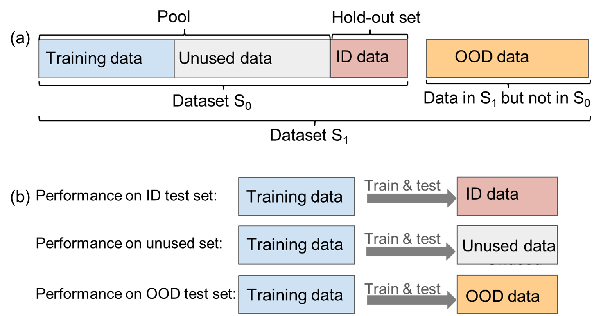
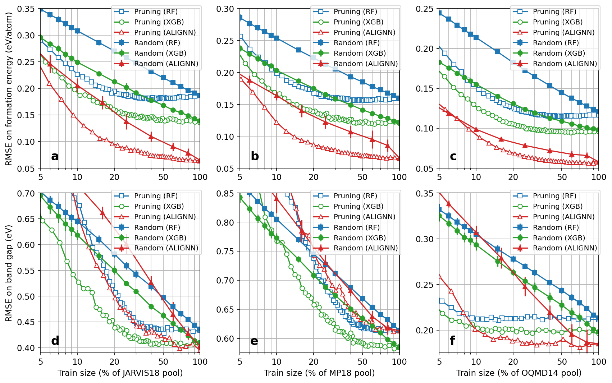
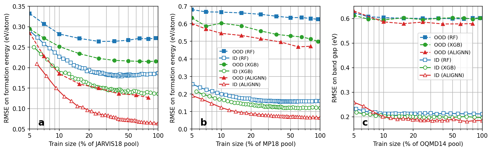
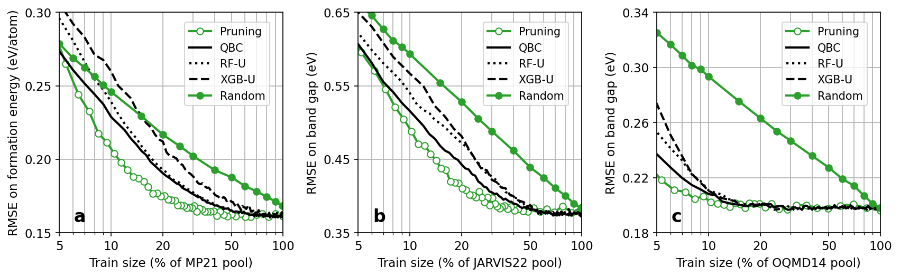

# Exploiting redundancy in large materials datasets for efficient machine learning with less data
---
Repo for the paper *Exploiting redundancy in large materials datasets for efficient machine learning with less data* published in [Nat Commun 14, 7283 (2023)](https://www.nature.com/articles/s41467-023-42992-y):
>Extensive efforts to gather materials data have largely overlooked potential data redundancy. In this study, we present evidence of a significant degree of redundancy across multiple large datasets for various material properties, by revealing that up to 95 % of data can be safely removed from machine learning training with little impact on in-distribution prediction performance. The redundant data is related to over-represented material types and does not mitigate the severe performance degradation on out-of-distribution samples. In addition, we show that uncertainty-based active learning algorithms can construct much smaller but equally informative datasets. We discuss the effectiveness of informative data in improving prediction performance and robustness and provide insights into efficient data acquisition and machine learning training. This work challenges the "bigger is better" mentality and calls for attention to the information richness of materials data rather than a narrow emphasis on data volume.

### Schematic of redundancy evaluation
<p align="left" width="100%">
    
    <br>
    <em>(a) Dataset splits. (b) Three prediction tasks to evaluate model performance and data redundancy. </em>
</p>
&nbsp;&nbsp; 

### Data redundancy manifested in in-distribution (ID) performance
<p align="center" width="100%">
    
    <br>
    <em>RMSE on the ID test sets. (a-c) JARVIS18, MP18, and OQMD14 formation energy prediction. (d-f) JARVIS18, MP18, and OQMD14 band gap prediction. The random baseline results to for the XGB and RF (or ALIGNN) models are obtained by averaging over the results of 10 (or 5) random data selections for each training set size. The X axis is in the log scale.</em>
</p>
&nbsp;&nbsp; 

### Data redundancy manifested in out-of-distribution (OOD) performance
<p align="center" width="100%">
    
    <br>
    <em>RMSE on the OOD test sets. (a) JARVIS formation energy prediction. (b) MP formation energy prediction. (c) OQMD band gap prediction. Performance on the ID test set is shown for comparison.</em>
</p>
&nbsp;&nbsp; 

### In-distribution performance during active learning campaigns
<p align="center" width="100%">
    
    <br>
    <em>RMSE on the ID test sets by the XGB models trained on the data selected using the active learning algorithms. (a) MP21 formation energy prediction. (b) JARVIS22 formation energy prediction. (c) OQMD14 band gap prediction. QBC: query by committee, RF-U: random forest uncertainty, XGB-U: XGBoost uncertainty. The performance obtained using the random sampling and the pruning algorithm is shown for comparison.</em>
</p>
&nbsp;&nbsp; 

## Dependencies
Please follow `setup_env.bash` to setup the python environment.
```
env_name="test"
conda create -n $env_name -y python=3.10
conda activate $env_name
conda install -y -c conda-forge scikit-learn py-xgboost-gpu  pandas matplotlib

# For data preprocessing and featurization 
conda install -y -c conda-forge pymatgen

# For getting uncertainty estimates of XGBoost
pip install ibug

# For using ALIGNN
pip install dgl -f https://data.dgl.ai/wheels/cu116/repo.html
pip install dglgo -f https://data.dgl.ai/wheels-test/repo.html
pip install alignn 
```


## Data
The JARVIS, Materials Project and OQMD dataset snapshots considered in this study and their description can be found on [Zenodo](https://zenodo.org/record/8200972).

## Scripts
The bash files `get_featurized_data.bash` and `run_al.bash` are provided as a demo to reproduce the QBC active learning results for the JARVIS22 dataset, which requires relatively low training cost. Scripts in the `codes` folder can be used to produce the full results but would require much higher training budget.
